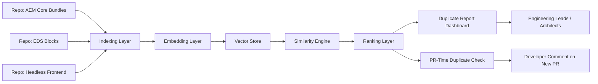

# Cross-Repo Duplicate Logic Detector

## Overview

Cross-Repo Duplicate Logic Detector is an AI-assisted tool that scans multiple repositories (AEM core bundles, OSGi services, Sling Models, EDS blocks, headless frontend code) and finds logic that different teams wrote independently but that is functionally similar or duplicated.

Unlike basic copy-paste detectors that only match identical text, this tool uses AI code embeddings to catch semantic duplication — the same logic written with different variable names, different structure, or a different language pattern.

## Problem Statement

In a large, multi-division codebase, teams often solve the same problem independently without knowing another team already solved it. This happens especially often with:

- validation logic
- pricing or calculation logic
- API response mapping
- form handling logic
- utility functions in Sling Models or JS blocks

### Why this is costly

- When a bug is found and fixed in one copy, the other copies remain broken.
- Reviewers repeatedly approve the same pattern instead of pointing to a shared library.
- Technical debt grows silently because duplication is invisible without deep cross-repo knowledge.
- New developers have no way to discover that similar logic already exists elsewhere.
- Divergence increases over time: each copy is modified slightly differently, making eventual consolidation harder.

## Proposed Solution

Build a tool that indexes code across selected repositories, generates embeddings for logical code units, and detects near-duplicate logic across repo and division boundaries.

The tool will:

- chunk code into logical units (functions, methods, Sling Model classes, JS functions, HTL logic blocks)
- generate embeddings for each chunk using a code-aware embedding model
- compare embeddings across repositories to find high-similarity matches
- rank duplicates by risk and impact
- surface results as a report and as PR-time warnings

## How It Works

### 1. Indexing Layer

Chunk each repository into logical units:

- Java methods and classes (Sling Models, OSGi services)
- JavaScript functions (EDS blocks, headless frontend)
- HTL template logic blocks

### 2. Embedding Layer

Generate vector embeddings for each code chunk using an off-the-shelf code embedding model. No custom model training is required for the MVP.

### 3. Similarity Engine

Compare embeddings across repositories and divisions to find chunks above a similarity threshold. Store matches as duplicate pairs with a similarity score.

### 4. Ranking Layer

Score each duplicate pair by:

- number of repos/divisions containing the same logic
- size and complexity of the duplicated logic
- how recently each copy was modified (diverging copies are higher risk)
- whether the logic touches shared, business-critical areas (pricing, validation, auth)

### 5. Output Layer

- a ranked dashboard: "Top duplicate logic pairs across repos"
- a PR-time check: when a new PR adds code that duplicates existing logic elsewhere, comment with a link to the existing implementation and a suggestion to consolidate

## Architecture Diagram

## Where It Fits Into the Existing Workflow

- **Scheduled job**: runs weekly across all indexed repos and produces a duplicate logic report.
- **PR-time check**: when a new PR is opened, compares newly added code against the cross-repo index and flags likely duplication before merge.

## Business Impact

### IT Value

- Fixes need to happen once instead of in every duplicate copy.
- Reduces reviewer burden — reviewers can point to an existing implementation instead of re-reviewing the same logic.
- Encourages a shared component/library culture across the global AEM repo.
- Gives architects visibility into where consolidation would have the highest payoff.

### Business Value

- Lower long-term maintenance cost.
- Fewer inconsistent bugs across divisions caused by only one copy being patched.
- Measurable technical debt reduction over time.

### Measurable Outcomes

- number of duplicate logic instances identified
- number of duplicates consolidated into shared libraries
- lines of code reduced through consolidation
- reduction in duplicate-bug-fix incidents (same bug found in multiple repos)

## MVP Scope

To keep the hackathon version realistic:

- Index 2-3 repositories (for example, the AEM core bundle, one EDS blocks repo, one headless frontend repo).
- Chunk only at function/method level to start.
- Use an existing code embedding model — no custom training.
- Output a simple ranked list of the top duplicate pairs with file paths and similarity scores.

### What Not to Build in MVP

- automatic code consolidation or refactoring
- support for every language/framework in the org
- a fully automated approval workflow for merging duplicates

## Demo Flow

1. Show two files from different repos that look different but do the same thing.
2. Run the tool and show it detects the similarity with a score.
3. Show the suggested consolidation recommendation.
4. Open a new PR that duplicates existing logic and show the bot flagging it immediately.

## Why It Is a Good Hackathon Idea

- It goes beyond "yet another AI PR reviewer" by targeting a problem most review tools miss: semantic duplication across repos.
- It is directly relevant to a multi-division, shared-repo AEM environment.
- It has a clear, measurable outcome: duplicate instances found, LOC reduced, bugs prevented.
- It complements the earlier shared-component-risk idea as the proactive counterpart — finding duplication before divergence causes risk, rather than reacting to a shared component change.

## Elevator Pitch

Cross-Repo Duplicate Logic Detector uses AI code embeddings to find logic that different teams wrote independently across AEM, EDS, and headless repositories. It flags near-duplicate implementations, ranks them by risk, and suggests consolidation, reducing long-term maintenance cost and preventing bugs that get fixed in one copy but not others.

## Submission Summary

### Title

Cross-Repo Duplicate Logic Detector

### Problem

Teams across divisions often write similar or identical logic independently, leading to duplicated bugs, inconsistent fixes, and growing technical debt that is invisible without deep cross-repo knowledge.

### Solution

An AI-assisted tool that uses code embeddings to detect near-duplicate logic across repositories, ranks it by risk, and flags it both in a periodic report and at PR time.

### Business Impact

Reduces long-term maintenance cost, prevents inconsistent bug fixes across divisions, and encourages reuse of shared components and libraries across the organization.
