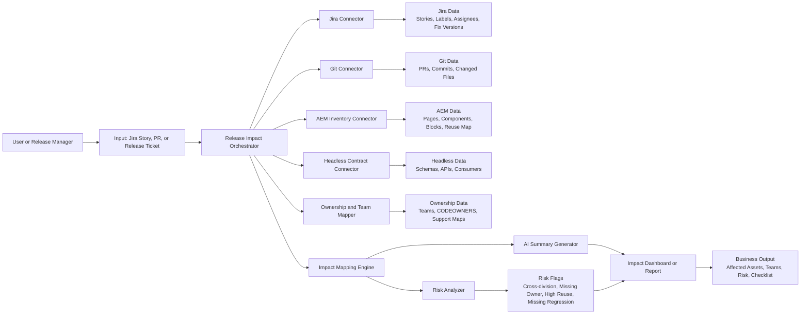

# AEM Shared Component Risk Analyzer

## Idea Summary

AEM Shared Component Risk Analyzer is an internal AI-assisted tool that takes a Jira story, pull request, or release ticket and identifies the likely blast radius of a change before deployment. It shows which AEM components, pages, headless APIs, business divisions, and owning teams are affected, along with a risk summary and regression checklist.

The goal is to reduce manual effort in release planning, avoid late discovery of dependencies, and lower the risk of shared AEM component regressions across divisions.

## Problem Statement

Today, release impact is often discovered manually and too late.

In the current workflow, a developer fixes a bug or implements a change in an AEM component, merges it, and validates it in QA. Because AEM components are shared across divisions, one small change can affect several pages, teams, or business areas.

Teams have to inspect Jira stories, linked pull requests, changed files, AEM pages, headless contracts, and ownership information separately. This creates several problems:

- Release planning takes too much manual coordination.
- Dependencies between teams are discovered late.
- Reviewers may miss affected pages, components, APIs, or downstream divisions.
- Release sign-off becomes slower and riskier.
- Production issues can happen because the full blast radius was not visible early enough.

This problem is more serious in a global AEM repository where the same component can be reused by many divisions. A change that looks local in one Jira story may create regression risk in several other business areas.

In short, the organization spends time assembling release impact data instead of acting on it.

## Proposed Solution

Build an AI-assisted shared component risk analyzer that automatically creates a blast-radius view for a Jira story, pull request, or release ticket.

The solution will:

- Read a Jira story, release ticket, or fix version.
- Pull related work items, linked pull requests, and changed files.
- Map code changes to AEM components, reusable pages, headless endpoints, divisions, and teams.
- Identify where the changed component is reused across the shared repository.
- Highlight likely risk areas such as cross-division dependencies, missing ownership, or missing regression evidence.
- Generate a plain-language impact summary and suggested regression scope.

This is not intended to replace engineering judgment. It is intended to remove the manual discovery work that slows release planning and increases release risk.

## How It Works

The implementation can be split into four layers.

### 1. Input Layer

The user provides one of the following:

- Jira story key
- Release ticket
- Fix version
- Branch or pull request reference

### 2. Data Collection Layer

The tool gathers information from existing systems:

- Jira: stories, linked issues, assignees, labels, fix versions, release metadata
- GitHub or GitLab: pull requests, commits, changed files, branches
- AEM inventory: pages, templates, blocks, content fragments, component usage, cross-division reuse
- Headless inventory: OpenAPI specs, GraphQL schemas, frontend contract mappings
- Ownership map: CODEOWNERS, team registry, Jira components, support mappings

### 3. Mapping and Risk Layer

This is the core of the solution.

The system converts technical changes into business impact using deterministic mappings first:

- file path to component
- component to page, feature area, or division
- API/schema change to dependent applications
- component/page/API to owning team

Then an AI layer helps summarize and classify impact by:

- grouping related changes
- describing blast radius in plain language
- flagging possible missing dependencies
- suggesting review areas and regression scope

### 4. Output Layer

The user receives a release impact report showing:

- affected AEM pages
- affected reusable components
- affected headless APIs or schemas
- affected divisions or business units
- impacted teams and owners
- risk score or priority level
- recommended regression checklist
- short release summary for managers or release notes

## Architecture Diagram

## Business Impact

This idea focuses on measurable operational value rather than novelty alone.

### Expected Benefits

- Reduce time spent manually analyzing release impact.
- Improve coordination across product, engineering, QA, and content teams.
- Improve visibility for global shared-component changes across divisions.
- Surface hidden dependencies earlier in the release cycle.
- Reduce risk of missed regression areas.
- Speed up release sign-off and readiness reviews.

### Measurable Outcomes

Possible success metrics include:

- reduction in release planning effort per epic or release
- reduction in time to identify impacted teams
- reduction in time to identify impacted divisions using a shared AEM component
- reduction in delayed approvals caused by missing dependency visibility
- reduction in release defects caused by unknown impact
- faster turnaround for release readiness reporting

## Why This Idea Is Valuable

Many teams already have Jira, Git, AEM, and API repositories, but the information is spread across tools. The real problem is not missing data. The problem is fragmented visibility.

This solution creates a single, understandable release impact view from systems the company already uses. That makes it realistic, low-risk, and scalable.

## MVP Scope

To keep the hackathon implementation achievable, the MVP should stay narrow.

### MVP Inputs

- One Jira project
- One Git repository
- One AEM site or component inventory
- One ownership mapping source

### MVP Output

For a given Jira story, return:

- affected stories and pull requests
- changed files
- mapped components
- mapped pages, feature areas, or divisions
- impacted APIs or contracts
- impacted teams
- a simple risk level
- a short natural-language summary

### What Not to Build in MVP

- full enterprise-wide dependency graph
- deep machine learning prediction engine
- perfect content-to-code lineage for all systems
- production-grade approval workflow

The MVP should prove that useful blast-radius analysis can be produced quickly from existing project metadata.

## Sample User Flow

1. A release manager enters Jira story `ABC-123`.
2. The tool fetches linked stories, labels, assignees, and pull requests.
3. It analyzes changed files from the related branches or PRs.
4. It maps those files to AEM components, pages, divisions, APIs, and teams.
5. It identifies reuse risk for shared components across the global repository.
6. It returns a report showing likely release impact.

Example output:

- 3 AEM pages affected
- 4 reusable components touched
- 5 divisions consume one of the modified shared components
- 2 API contracts impacted
- 2 teams need review
- 1 missing ownership mapping
- overall risk: medium

## Implementation Approach

### Phase 1. Deterministic Mapping

Start with rules, not heavy AI.

- Jira epic to linked PRs
- PRs to changed files
- file paths to components
- components to pages, feature areas, or divisions
- assets to owner teams

For your company flow, the most important rule is this:

- changed shared component to all known consuming divisions

That rule is what turns this from a normal dashboard into a real release-safety tool.

This provides reliable early value and is easy to validate.

### Phase 2. AI Assistance

Use AI where summarization and reasoning help most:

- summarize technical impact for non-technical stakeholders
- explain likely blast radius in simple language
- identify probable review gaps
- suggest a regression checklist based on impacted assets

### Suggested Tech Stack

- Backend: Node.js or Python service
- Integrations: Jira REST API, GitHub or GitLab API, internal metadata sources
- Storage: lightweight mapping store such as JSON, YAML, or a small database
- UI: simple dashboard or generated Markdown/HTML report
- AI: LLM for summarization, categorization, and checklist generation

## How We Ensure It Helps Prevent Breakage

The tool cannot mathematically guarantee that nothing will break in AEM. No release tool can do that. What it can do is make hidden impact visible before production and improve release discipline.

When a developer changes a shared AEM component, the tool should answer these questions:

- Which exact files and components changed?
- Which pages or templates use this component?
- Which divisions consume this component from the shared repository?
- Was this component changed recently in another release?
- Which regression scenarios should be tested in QA and UAT?

The risk score can be based on weighted factors such as:

- shared component reused across many divisions
- number of files changed
- JavaScript, template, or styling changes in core components
- API or schema contract changes
- missing regression evidence
- production-critical component such as navigation, forms, header, footer, search, or authentication-related areas

Example risk bands:

- low: isolated change, one team, low reuse, regression evidence attached
- medium: shared component change with multiple impacted pages or one dependent division
- high: widely reused component, cross-division impact, or API contract change

Instead of doing generic regression, the tool proposes targeted regression scope:

- impacted AEM pages to test
- impacted division experiences to validate
- impacted API flows to retest

This makes QA and release reviews more focused and more defensible.

## Risks and Mitigations

### Risk: Incomplete mapping accuracy

Mitigation:
Start with a limited scope and explicit ownership maps. Show confidence levels where needed.

### Risk: Data spread across inconsistent systems

Mitigation:
Integrate only the most reliable sources in MVP and use fallback rules.

### Risk: Perception that AI is replacing release decisions

Mitigation:
Position the tool as a planning assistant that improves visibility, not an approval engine.

### Risk: Teams may trust the dashboard without validating the actual application

Mitigation:
Clearly state that the dashboard supports QA and release decisions but does not replace testing.

## Demo Plan

The hackathon demo should be simple and visual.

1. Enter a Jira epic or release key.
2. Show linked stories, PRs, and developer information.
3. Show changed files being mapped to shared components, pages, divisions, and APIs.
4. Show the risk score and missing regression evidence.
5. Show the final impact dashboard.
6. End with a short manager-friendly summary and regression checklist.

## Elevator Pitch

AEM Shared Component Risk Analyzer helps teams understand the blast radius of a Jira story before it goes live. Instead of manually checking Jira, Git, AEM, shared component usage, and API dependencies, the tool automatically identifies affected pages, components, divisions, APIs, and teams, then generates a risk summary and regression checklist. This reduces manual planning effort, improves coordination, and lowers release risk.

## Submission-Ready Summary

### Title

AEM Shared Component Risk Analyzer

### Problem

Release impact analysis is manual, fragmented, and often discovered too late across Jira, code, AEM, and headless systems.

### Solution

An AI-assisted tool that takes a Jira story, pull request, or release ticket and automatically identifies affected pages, shared components, divisions, APIs, and teams, along with risk indicators and regression scope.

### Business Impact

Reduces release planning effort, speeds up sign-off, improves dependency visibility across shared components, and lowers the chance of business disruption caused by missed release impact.

### Why It Matters

It solves a real operational problem using systems the company already has, making it practical, measurable, and scalable.

## Other Ideas to Explore Later

If you want to compare options before final submission, these are also strong:

- Figma to AEM Component Mapper: suggest the closest reusable AEM block from a design.
- AEM Content Quality Checker: flag missing alt text, broken links, weak headings, and metadata gaps.
- Jira Story to Release Summary Bot: turn Jira and Git changes into a simple release summary for business teams.