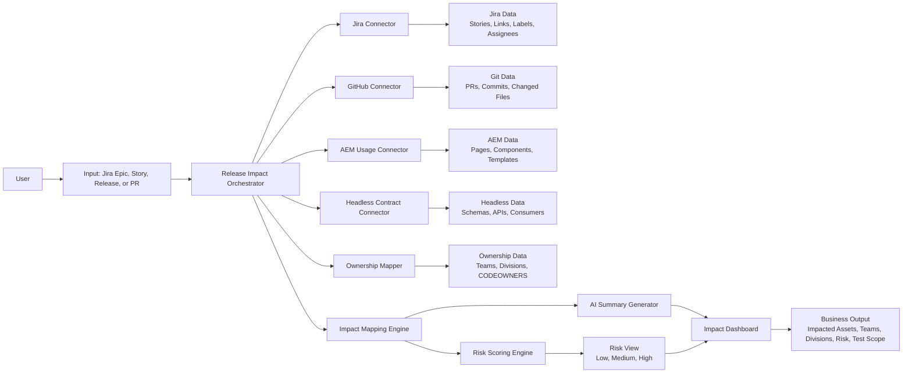

# Release Impact Analyzer

## Overview

Release Impact Analyzer is an internal platform-level tool that helps teams understand the blast radius of a change before it moves toward release.

The user enters a Jira epic, release ticket, story, or pull request, and the system identifies:

- which pages are affected
- which AEM components are affected
- which headless APIs or schemas are affected
- which teams or divisions are impacted
- what regression areas should be reviewed
- what the overall risk level is

The main purpose is to reduce manual release analysis and make hidden dependencies visible earlier.

## Problem Statement

Today, release impact analysis is mostly manual.

When a change is made, teams often need to look across multiple systems to understand what might be affected. They check Jira for requirements, GitHub for pull requests and changed files, AEM for component usage, and headless systems for API dependencies. This process is slow, fragmented, and depends heavily on individual knowledge.

In a shared platform environment, this becomes more risky because one component or API change can affect multiple pages, teams, applications, or divisions.

### Current Challenges

- Release impact is not visible in one place.
- Teams spend time manually tracing dependencies.
- Shared AEM components can affect multiple divisions.
- API or schema changes may break downstream consumers.
- Regression scope is often guessed instead of identified systematically.
- Release planning becomes slower and more error-prone.

## Proposed Solution

Build an AI-assisted Release Impact Analyzer that combines information from Jira, GitHub, AEM, and headless systems into one impact view.

The tool will:

- read a Jira epic, story, release, or pull request
- identify related work items and changed files
- map changed files to AEM components, pages, and APIs
- identify reuse of shared components across divisions
- show likely impacted teams and owners
- calculate a risk score
- suggest regression areas for QA and release review
- generate a plain-language summary for technical and non-technical stakeholders

## How It Works

The solution can be explained in four layers.

### 1. Input Layer

The user provides one of the following:

- Jira epic key
- Jira story key
- release ticket
- pull request number or URL
- branch name

### 2. Data Collection Layer

The system pulls data from multiple sources:

- Jira: epic, stories, linked issues, labels, assignees, fix versions
- GitHub: pull requests, commits, changed files, authors
- AEM inventory: components, blocks, templates, page usage
- headless systems: OpenAPI specs, GraphQL schemas, consumer mappings
- ownership data: CODEOWNERS, team mappings, application ownership

### 3. Mapping and Analysis Layer

This is the core of the solution.

The tool maps technical changes into business impact using rules such as:

- file path to component
- component to page or template
- component to consuming division
- API change to dependent application
- page/component/API to owning team

After that, the AI layer helps summarize and classify the impact:

- identify blast radius
- describe risk in plain language
- highlight shared component exposure
- suggest likely regression scope
- surface missing ownership or dependency concerns

### 4. Output Layer

The user sees a dashboard or report with:

- impacted pages
- impacted components
- impacted APIs
- impacted teams
- impacted divisions
- change owner or developer
- risk score
- regression checklist
- short business summary

## Architecture Diagram

## Why This Matters

This idea is valuable because it supports both IT and business stakeholders.

### IT Value

- reduces manual dependency tracing
- improves understanding of change blast radius
- helps QA target regression testing more accurately
- improves release confidence
- surfaces cross-team dependencies early

### Business Value

- reduces release planning effort
- lowers the chance of production regressions
- improves coordination across teams and divisions
- speeds up release readiness decisions
- creates a more reliable and scalable release process

## Measurable Impact

This idea aligns well with hackathon goals because the impact can be measured.

Possible metrics:

- reduction in time spent preparing release impact analysis
- reduction in manual coordination across teams
- faster identification of impacted owners
- reduction in missed regression areas
- reduction in release defects caused by hidden dependencies

## Example Use Case

1. A release manager enters Jira epic `ABC-123`.
2. The tool finds the related stories and pull requests.
3. It analyzes changed files from the linked pull requests.
4. It maps those files to AEM components and pages.
5. It checks whether any shared components are reused across multiple divisions.
6. It checks whether related APIs or schemas are also impacted.
7. It generates an impact report.

Example output:

- 4 AEM components affected
- 12 pages impacted
- 2 APIs affected
- 3 divisions impacted
- 4 teams need review
- overall risk: medium
- recommended regression focus: navigation, product detail pages, API response handling

## Risk Scoring Model

The tool can calculate risk using weighted indicators such as:

- number of files changed
- type of files changed
- whether a shared component is involved
- number of consuming pages or divisions
- whether a core UI component is affected
- whether an API contract changed
- whether multiple teams are impacted

### Example Risk Levels

- Low: isolated change with limited usage and no downstream dependency
- Medium: shared component change or multiple affected pages
- High: shared component plus API impact, or cross-division usage with high visibility

## MVP Scope

To keep the hackathon version realistic, the MVP should stay narrow.

### MVP Inputs

- one Jira project
- one GitHub repository
- one AEM site or shared component inventory
- one simple ownership map

### MVP Capabilities

- enter Jira story or epic
- fetch related PRs and changed files
- map changes to components and pages
- identify impacted teams or divisions
- generate risk score
- show a simple dashboard or report

### What Not to Build in MVP

- enterprise-wide perfect dependency mapping
- full automated approval workflows
- predictive machine learning models beyond basic AI summarization
- deep production monitoring integration

## Suggested Tech Stack

- Backend: Node.js or Python
- APIs: Jira REST API, GitHub API
- Metadata store: JSON, YAML, or lightweight database
- UI: React dashboard or generated HTML report
- AI: LLM for summarization, impact explanation, and regression suggestion

## Demo Flow

The demo should be simple and visual.

1. Enter a Jira epic or PR.
2. Show linked issues and changed files.
3. Show mapping to AEM components, pages, and APIs.
4. Show impacted divisions and teams.
5. Display risk level.
6. End with a short summary and suggested regression focus.

## Why It Is a Good Hackathon Idea

This is a strong hackathon idea because:

- it solves a real operational problem
- it is relevant to AEM and headless platforms
- it has value beyond one project or one team
- it is practical to prototype
- it produces measurable impact
- it is easy to explain to judges and stakeholders

## Elevator Pitch

Release Impact Analyzer is an AI-assisted platform capability that helps teams understand the blast radius of a Jira epic, release, or pull request before deployment. By connecting Jira, GitHub, AEM, and headless system metadata, it identifies affected pages, components, APIs, teams, and divisions, then highlights risk and recommends regression focus. This reduces manual planning effort, improves release visibility, and lowers the chance of production regressions.

## Submission Summary

### Title

Release Impact Analyzer

### Problem

Release impact analysis is manual, fragmented, and difficult in shared AEM and headless environments where one change can affect many pages, teams, or divisions.

### Solution

An AI-assisted analyzer that takes a Jira epic, story, release, or pull request and automatically identifies affected pages, components, APIs, teams, and divisions, along with a risk score and regression focus.

### Business Impact

Reduces manual release analysis, improves coordination, speeds up planning, and lowers the risk of business disruption from missed dependencies.